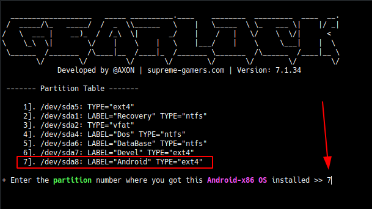

So here we gonna learn ways of installing GearLock in your desired android-x86 system. There are several ways of doing so, you just need to pay some attention and read everything properly to avoid errors.

### Get the latest GearLock installer binary

Simply head over to [this](https://supreme-gamers.com/r/gearlock-custom-recovery-replacement-for-android-x86.40) link and click on **Download** button.


### Place the binary anywhere inside android filesystem

In this guide we will copy `gearlock` installer-binary to either **Main Storage** or **Internal Storage** or **/sdcard** from a file manager.

I'm using [FX File Explorer](https://fx-file-explorer.en.uptodown.com/android) for moving `gearlock` installer-binary to **Main Storage** (aka the **Internal Storage**) from my **Downloads** folder.

### Switch to command terminal / console

Now press either `Alt + F1` or `fn + Alt + F1` for switching to a command terminal.

If the buttons are not working as suggested above then install [Termoneplus](https://apkpure.com/termone-plus-terminal-emulator/com.termoneplus) terminal emulator and open it.

### Run the installer binary

Once you're in a black terminal prompt, type in the following and press **Enter** key after each line.

```bash
su
cp /sdcard/gearlock /data
cd /data
chmod 777 gearlock
./gearlock
```

### Select your operating-system partition in the installer

So, at this stage you should have the installer-binary running. I have my android-x86 operating system installed inside the 7th partition called **Android**. Enter the partition number of your android-x86 installation.


### Installation complete

Congrats, you have successfully installed GearLock. Now you should check the next pages in this chapter to learn about the amazing things you can do with it :)

# Updating

You will get notified in GearLock when there is a new update available.

You will be able to update directly from `GearLock > metro > more > Updater`

You can also follow the same instructions of **Installing GearLock** as described in the beginning of this page to perform a update over an existing version and the old version will be overwritten. 

# Video guides

I seriously don't prefer to follow video guides, only mentioning them here just if they are any useful to you...

!!!warning Warning
These video tutorials can be outdated, proceed at your own risk!
!!!

- https://www.youtube.com/watch?v=tg_lLrGaoYE

# Troubleshooting

**Todo..**
